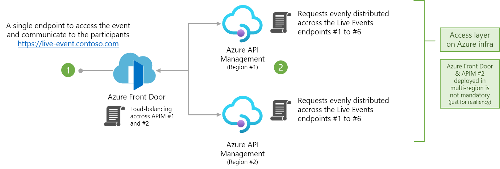
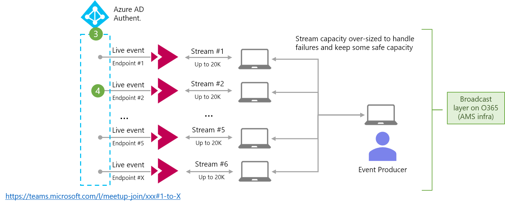
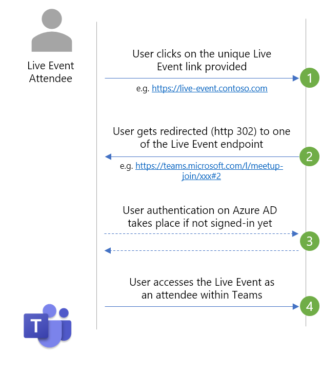

# Teams Live Event Traffic Distributor

## What it is

This solution was built to load balance users between a number of Microsoft Teams Live Events, since one Live Event can only host a couple of thousand clients (current limit of 20K attendees per Live Event stream) - For Live Events that need to go beyond this limit, the recommendation as of now is to publish the produced content across multiple streams, each of them having a different URL. This situation brings some complexity in terms of communication and management of the event as it requires to split the audience in pools of 20K users.

More info on setting-up a Teams Live Event can be found [here](https://docs.microsoft.com/microsoftteams/teams-live-events/plan-for-teams-live-events).

The following solution covers this challenge by automatically distributing the Live Event URLs to the users from a unique URL. By default, this is the URL of Azure Front Door, e.g. `myliveevent.azurefd.net`, instead of a URL to the Teams Event directly. To achieve this load balancing, API Management is being used to randomly and evenly redirect client requests, using HTTP 302 status code, to one of the URL of the actual Live Event. Also, to manage the capacity and resiliency of the solution, we recommend to have a spare stream - e.g. for 100K participants, you'll need 6 streams (6 x 20K = 120K users max)


Note: The unique URL can be changed by either using a URL shortener like Bitly or also by adding your own custom domain to Front Door (e.g. `myliveevent.contoso.com`) - Check the documentation to [Configure HTTPS on a Front Door custom domain](https://docs.microsoft.com/azure/frontdoor/front-door-custom-domain-https)

## Azure Components

The solution deploys the following components:

- Azure Front Door for global load balancing and failover
- n number of Azure API Management instances in Consumption tier, in different regions for resiliency
- Azure Application Insights including on Azure Portal Dashboard for monitoring
- n number of Azure Storage Accounts with one Table storage each. These are only being used (and only will incur costs) when using the table-storage mode for a high number of backend URLs

<p align="center">
    <br>
    
    <br><br>
    
    <br><br>
    
</p>

## Alternative use cases

While the solution was originally built for Teams Live Events, it can easily be repurposed for any kind of similar load balancing where the backends are hosted on the same domain.

## How to use

### Optional: Make changes and build Bicep
This solution uses [bicep](https://github.com/Azure/bicep) templates which are then compiled into ARM templates. If you wish to make any changes, do so in the bicep templates and compile it. It is not recommended to modify the ARM template (main.json). If you didn't make any changes, you can just use the main.json ARM template file from the repo which was already generated. If you use an current Azure CLI version, you can also deploy the main.bicep file directly, without building it first.

### Deploy to Azure via CLI
Create a resource group (change the location based on your needs)
```
az group create -n myresource-group -l northeurope
```

There are three different deployment types available, based on how many backend URLs you need to distribute traffic to. (the reason for this is a length limitation in API Management Policy definitions).

#### Default Policy-based mode - **this mode should be applicable to most users.**
Use this when the list of all your backend URLs combined is not longer than approx. 14,000 characters. In this case the list of URLs is injected directly into the policy of API Management.

Use this command to deploy the ARM template - replace the **backends** parameter with your individual, comma-separated list of Event URLs and **additionalLocations** based on your preferences.
```
az deployment group create -g  myresource-group --template-file .\main.bicep -p prefix=myprefix -p additionalLocations="['eastus2','westeurope']" -p loadBalancingMode=default -p backends="https://teams.microsoft.com/l/meetup-join/1,https://teams.microsoft.com/l/meetup-join/2,https://teams.microsoft.com/l/meetup-join/3"
```

#### Table-storage mode - for large number of backend URLs
In this case the URLs must be imported after the ARM template deployment into Table storage accounts and APIM fetches them from there. See below for details on this. \
Use this command to deploy the ARM template - replace the **additionalLocations** parameter based on your preferences. Note that we are not specifying the URLs here yet and instead setting the parameter `loadBalancingMode=largeEvent`.
```
az deployment group create -g  myresource-group --template-file .\main.bicep -p prefix=myprefix -p additionalLocations="['eastus2','westeurope']" -p loadBalancingMode=largeEvent
```

After the deployment finished, you need to import the list of URLs into both Table storage accounts. Use the `import-urls-to-table.ps1` PowerShell script in the `testing` folder for this purpose.


#### Language-based routing mode - distribute users to different backends based on their browser language (or a query parameter)
To use this more, your list of backends must be formatted different. See the following example.
**Note**: This mode currently only supports a list of URLs that is not longer than approx. 14,000 characters.

Use this command to deploy the ARM template - replace the **backends** parameter with your individual, semicolon-separated list of Event URLs, starting with the language code. Within each language code you can have multiple URLs. In this case, those will be load-balanced as well. There always needs to be at least one URL for English (`en`) as this is used as the fallback option. Also, update **additionalLocations** based on your preferences.

Let's take the following example:
- For **French (fr)**, you have the following three URLs to redirect and load balance users to: **https://URL_FR_1**, **https://URL_FR_2** and **https://URL_FR_3**
- For **German (de)**, you have the following single URL to redirect users to: **https://URL_GE_1**
- For **English (en)**, you have the following two URLs to redirect and load balance users to: **https://URL_EN_1** and **https://URL_EN_2**

Here is how you will create the "backends" string for such a configuration:
`backends="fr=https://URL_FR_1,https://URL_FR_2,https://URL_FR_3;de=https://URL_GE_1;en=https://URL_EN_1,https://URL_EN_2"`

Note: all other languages, not specified in the backends definition, will fall into "en" as a default.

```
az deployment group create -g  myresource-group --template-file .\main.bicep -p prefix=myprefix -p additionalLocations="['eastus2','westeurope']" -p loadBalancingMode=userLanguage -p backends="fr=https://URL_FR_1,https://URL_FR_2,https://URL_FR_3;de=https://URL_GE_1;en=https://URL_EN_1,https://URL_EN_2"
```

In this mode, the browser request header `Accept-Language` is being used to determine which URL to use. Alternatively the query parameter `?lang=` can be set, which will then take precedence. For example: [https://{MYPREFIX}globalfrontdoor.azurefd.net?lang=fr]() to force French as the language.


#### Deploy through the Azure Portal
As an alternative to using command line, you can also deploy through the Azure Portal directly and set the parameters accordingly.

[](https://portal.azure.com/#create/Microsoft.Template/uri/https%3A%2F%2Fraw.githubusercontent.com%2FAzure%2Fteams-event-distributor%2Fmain%2Fdeployment%2Fmain.json)

### Test
Your initial URL - if you did not use a custom domain - will be like [https://{MYPREFIX}globalfrontdoor.azurefd.net]()- To test your setup, simply call this URL from a web browser and you should get redirected to one of your backend URLs. Try this a couple of times and you will see different forwarding targets. Note: Based on your browser or proxy settings, it might be that the forward target gets cached. In this case, just open a second browser (or use a private browsing tab).

_Note: After the first deployment it can take a couple of minutes until the Front Door URL goes lives and starts to your traffic_

## Costs
(only provided as an example, as of Feb-2021)

Overall cost for this solution is pretty minimal. The only reoccurring billing (without any incoming traffic), is for the Front Door routing configuration. All other costs are purely based on incoming traffic / usage.

- API Management - Consumption tier: $3.50 per 1 million calls. And the first 1 million calls per Azure subscription are free. [Pricing](https://azure.microsoft.com/pricing/details/api-management/)
- Front Door: $0.01 per GB incoming traffic, $0.17 per GB response traffic (Zone 1), $22 per month for the two routing rules. [Pricing](https://azure.microsoft.com/pricing/details/frontdoor/)
- Application Insights: $2.88 per GB ingested data - and the first 5 GB per billing account are included per month. [Pricing](https://azure.microsoft.com/pricing/details/monitor/)

The ARM template allows you to deploy the Azure services only for the preparation and duration of the Live Event. With a typical timeframe of 5 days and 100K attendees, the estimated cost of the solution is less than $5.

## Contributing

This project welcomes contributions and suggestions.  Most contributions require you to agree to a
Contributor License Agreement (CLA) declaring that you have the right to, and actually do, grant us
the rights to use your contribution. For details, visit https://cla.opensource.microsoft.com.

When you submit a pull request, a CLA bot will automatically determine whether you need to provide
a CLA and decorate the PR appropriately (e.g., status check, comment). Simply follow the instructions
provided by the bot. You will only need to do this once across all repos using our CLA.

This project has adopted the [Microsoft Open Source Code of Conduct](https://opensource.microsoft.com/codeofconduct/).
For more information see the [Code of Conduct FAQ](https://opensource.microsoft.com/codeofconduct/faq/) or
contact [opencode@microsoft.com](mailto:opencode@microsoft.com) with any additional questions or comments.

## Trademarks

This project may contain trademarks or logos for projects, products, or services. Authorized use of Microsoft
trademarks or logos is subject to and must follow
[Microsoft's Trademark & Brand Guidelines](https://www.microsoft.com/en-us/legal/intellectualproperty/trademarks/usage/general).
Use of Microsoft trademarks or logos in modified versions of this project must not cause confusion or imply Microsoft sponsorship.
Any use of third-party trademarks or logos are subject to those third-party's policies.
